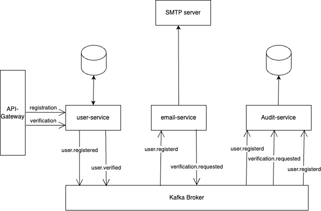

# 👤✍ User Registration & Email Verification System

## 📋 Overview

This system allows users to register with their email and password, and requires email verification to activate the account. It follows a service-oriented architecture and includes event-driven communication via Kafka.

## 🌐 Services

- **User Service**: Handles user registration, validation, persistence, and emits events for further processing.
- **Email Service**: Listens for user registration events and sends verification emails to users.
- **Audit Service**: Subscribes to key events (e.g., registration, verification) and logs them for traceability and compliance purposes.
> Use Cases
> 

## ⏩ Workflow

1. A user submits their registration details.
2. If valid, the `User Service` creates a new unverified user and emits a `user.registered.event`.
3. The `Email Service` receives this event and sends a verification email containing a token and send a `email.dispatched.event`.
4. The user clicks the verification link or submits the token manually.
5. The `User Service` validates the token and, if valid, updates the user's status to "verified", emitting a `user.verified.event`.
6. The `Audit Service` logs the registration, verification and email dispatching as `user.registered.audit`, `user.updated.audit` and `user.verification.request.audit`.
> User registration sequence
> 

> Deploy view
> 

## 🛠️ Technologies

- **Node.js** for backend services
- **Express** for HTTP server
- **Apache Kafka** for asynchronous event-based communication
- **MongoDB** for unestructured data persistence
- **Docker** for containerization

# ⚙️ BDD Toolchain for Microservices Project

This project follows the **Behavior-Driven Development (BDD)** methodology. Below is a proposed toolchain for implementing automated tests covering:
- HTTP API interactions
- Kafka-based messaging
- Database persistence
- Email dispatching

# 🧪 Test Strategy

## 📋 Overview

This section outlines the strategy for ensuring quality and reliability across the services in this system. The architecture involves multiple services communicating over Kafka, persisting over MongoDB and exposing a basic RESTful API. We will apply a Behavior-Driven Development (BDD) approach supported by automated testing across different levels.

>[!note]
> - [User Stories](/UserSories.md)
> - [Integration scenarios](/IntegrationScenarios.md)
---

## 🎯 Objectives

- Validate functional requirements
- Ensure reliable communication between services via Kafka
- Automate tests at different layers (integration, end-to-end)
- Detect regressions early via CI pipelines
- Maintain traceability and reproducibility of test results

---

## 🎚️ Test Levels

| Level             | Scope                                      | Tools / Frameworks                  |
|------------------|--------------------------------------------|-------------------------------------|
| ~~Unit Testing~~[*](https://github.com/luisiluck/User-registration#unit-testing)      | Individual functions, classes, modules     | Mocha / Chai                 |
| Integration       | Interaction between internal components    | Cucumber.js, Supertest, KafkaJS, Testcontainers  |
| End-to-End (E2E)  | Full user scenarios across services        | Cucumber.js, Testcontainers, Axios, Kafka |
| Regression        | Ensure new features don't break existing   | Github Actions              |

---

## 🔁 Test Lifecycle

1. **Test Planning**  [Planning](https://trello.com/b/SJi90Rb6/user-registration)   
   Define scope, scenarios, responsibilities

2. **Test Design**  
   Write Gherkin feature files, test cases, and setup mocks

3. **Test Implementation**  
   Develop automated tests, prepare test data

4. **Test Execution**  
   Run tests in local dev and CI/CD pipelines

5. **Test Reporting**  
   Generate reports (HTML, JSON) and publish artifacts

6. **Defect Management**  
   Log bugs in issue tracker, link to failing tests

---

## 🧰 Testing Tools

| Purpose            | Tool                                     |
|--------------------|------------------------------------------|
| BDD Framework      | Cucumber.js                              |
| API Testing        | Supertest, Axios                         |
| Messaging (Kafka)  | KafkaJS, Testcontainers                  |
| Test Data Setup    | Faker.js, Factory-js                     |
| Assertion          | Should                                   |
| Reporting          | JSON, Cucumber HTML Reporter             |
| CI/CD Integration  | GitHub Actions, Docker                   |

---

## 🔐 Environment Strategy

| Environment      | Purpose                         | Characteristics                     |
|------------------|----------------------------------|-------------------------------------|
| Local Dev        | Developer testing               | Full-stack with mocks, Docker-based |
| CI (Ephemeral)   | Automated regression checks     | Containerized, isolated, stateless  |

---

## 📝 Test Data Management

- Use seed scripts for predictable test environments
- Mask or anonymize production data for safe usage
- Support dynamic data generation using libraries like `faker.js`

---

## 🔗 HTTP Testing (SuperTest and Axios)

- Tests validate:
  - Request and response structure
  - Persistance
  - Alternative flows
- Use Supertest for white-box testing
- Use Axios for black-box testing

---

## 🔔 Event-Driven Testing (Kafka)

- Consumer and Producer tests validate:
  - Event structure
  - Topic delivery
  - Side effects and idempotency
- Use Kafka mocks or embedded Kafka during tests

---
## ✉️ Email Testing (Mailpit)

- Faker of a SMTP server
  - catch outcoming emails
  - Check email estructure
  - For integration and accptance testing
---

## 🗄 Database Testing (mongodb)

- A basic js library
  - Seed data before test
  - Assert database state after SUT operations
  - Mainly oriented to integration testing 
---

## ✅ Definition of Done

Each feature is considered **done** when:

- [ ] It has at least one BDD scenario in Gherkin
- [ ] Unit and integration tests are implemented
- [ ] The feature passes all E2E tests in CI
- [ ] Events are validated and published/subscribed correctly
- [ ] Test reports are generated and published

---

## 📊 Reporting & Coverage

- Generate test reports for:
  - ~~Unit: `nyc`, `mochawesome`~~
  - Integration/E2E: `JSON/cucumber-html-reporter`
- Code coverage threshold: **≥ 80%**
- Automated tests effort (Mike Cohn 2009)
  - Unit test: 50%
  - Integration test: 30%
  - E2E test: 20%
- Reports published as artifacts.

---

## 🚀 CI/CD Integration

All tests are executed in CI pipelines on:

- Push to `release` or `master` branches
- Pull Request events
- Nightly regression runs

Stages:

1. Checkout Code
2. Build & Lint
3. Run Unit Tests
4. Spin up Services via Docker
5. Run Integration + E2E Tests
6. Publish Reports

---

## 📌 Risks & Mitigation

| Risk                        | Mitigation Strategy                     |
|-----------------------------|------------------------------------------|
| Flaky E2E Tests             | Use retries, stable test data            |
| Kafka Message Duplication   | Ensure idempotency and deduplication     |
| Long Test Times             | Run tests in parallel, isolate services  |

---
## 📌 Pending tasks

   - ### Automated test framework refactorization
      The Acceptance Tests project and each integration test project have common tools which should be arranged in a library in order to ensure the reutilization and quick deploy in new projects, the framework maintenance, scalability, etc.
      
   - ### Domain Driven Design 
      The domain approach was avoid since the SUT is bussiness agnostic but should be considered in order to set effective mock an contract testing design.
     - Mocks
     - Contract testing
   - ### Unit testing 
      the services are just functional prototypes so each one is very coupled making it hard to test their components isolated, but a good unit testing implementation is an essential quality gate.
   - ### SRE
      Service Oriented Architectures usually encourage scalability, maintainability, shorter release cycles, etc. but them also add complexity understanding issues and risks. So a good obserbability approach is essential for quality assurance.  
       - Performance testing
       - Reliability testing
       - logs
       - metrics
       - Traces
---

## 📍 References

- [Cucumber.js Documentation](https://github.com/cucumber/cucumber-js)
- [KafkaJS Documentation](https://kafka.js.org/)
- [GitHub Actions Docs](https://docs.github.com/en/actions)
- [Testcontainers](https://node.testcontainers.org/)
- [mailpit](https://mailpit.axllent.org/)
- [axios](https://axios-http.com/)
- [supertest](https://github.com/ladjs/supertest)

---
